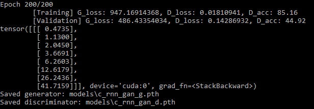

# Music Generation using C-RNN-GAN in PyTorch

## Introduction

This project is a PyTorch implementation of [C-RNN-GAN](https://github.com/olofmogren/c-rnn-gan), which was originally developed in TensorFlow. In a nutshell, C-RNN-GAN is a GAN variant where both the Generator and the Discriminator are RNNs, with each output at each timestep from the Generator correspondingly fed into each timestep as input to the Discriminator. The goal is to train the Generator to output structured sequences, such as MIDI music which was used in the paper. If you'd like to know more, head over to this [link](http://mogren.one/publications/2016/c-rnn-gan/) or read the [paper](http://mogren.one/publications/2016/c-rnn-gan/mogren2016crnngan.pdf).

## Status

The implementation can work well on simple sequences such as `a(n+1) = 2*a(n)`, where each element is twice of the previous. You can try this by executing:
```
$ python train_simple.py
```
This runs for 200 epochs, after which you should get something similar to this:



When fed with MIDI data, training of this C-RNN-GAN implementation tends to be unstable. A lot of hyperparameter tweaking and training techniques such as freezing have been implemented, in which I managed to generate some convincing MIDI music, but not reproducible even while using the same set of hyperparameters and techniques. Nevertheless, I'll share these runs:

```
$ python train.py --g_lrn_rate=0.0001 --d_lrn_rate=0.0004 --g_pretraining_epochs=10 --d_pretraining_epochs=10 --label_smoothing 
```
* Adam optimizer for both G and D, with learning rates 0.0001 and 0.0004, respectively
* Pre-trains G and D independently for 10 epochs i.e. Train G for 10 epochs with D frozen & vice versa
* Use label smoothing on real data i.e. use 0.9 as label instead of 1.0
* Output: [sample1.mid](samples/sample1.mid)

```
$ python train.py --use_sgd --g_lrn_rate=0.01 --d_lrn_rate=0.005 --label_smoothing --feature_matching
```
* SGD optimizer for both G and D, with learning rates 0.01 and 0.005, respectively
* Pre-trains G and D independently for 5 epochs (default)
* Use label smoothing
* Use feature matching for G loss (refer to [paper](http://mogren.one/publications/2016/c-rnn-gan/mogren2016crnngan.pdf) for more info)
* Output: [sample2.mid](samples/sample2.mid)

## Deviations from Original

This implementation is not an exact port of the original. These are some of the differences in particular:

* Different set of hyperparameters
* Added label smoothing
* Added option to use Adam optimization 
* Pitch is not represented as frequency, but simply as numerical representation of each tone in MIDI (e.g. C3 = 60)
* Training is done only on small subset of classical data (sonata-sounding pieces of Mozart in particular, see [sonata-ish](data/classical/sonata-ish))

## Prerequisites

* Python 3.6
* PyTorch
* [python3-midi](https://github.com/louisabraham/python3-midi)

## License

This project is licensed under the Apache License, Version 2.0 - see the [LICENSE](LICENSE) file for details
